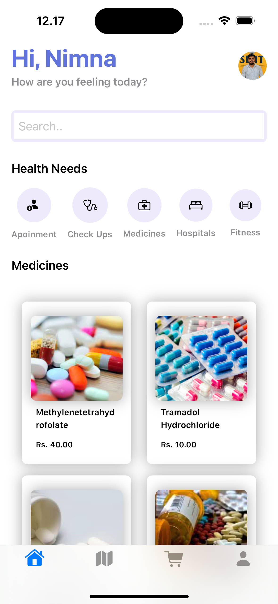
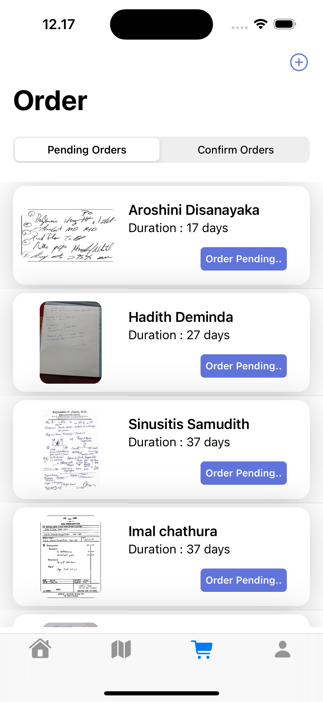
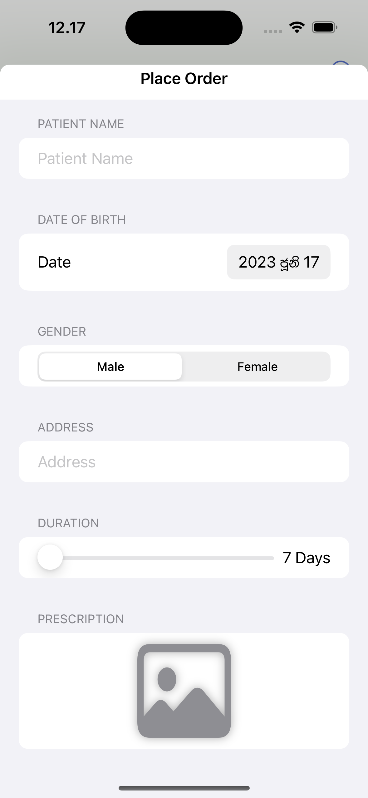
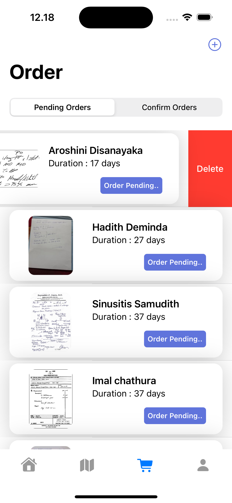
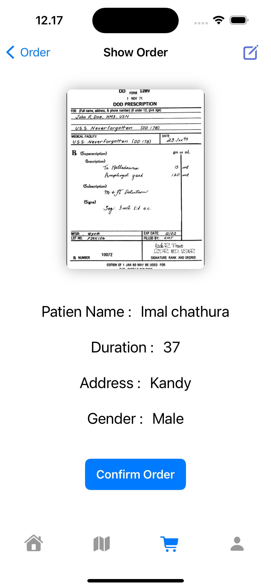
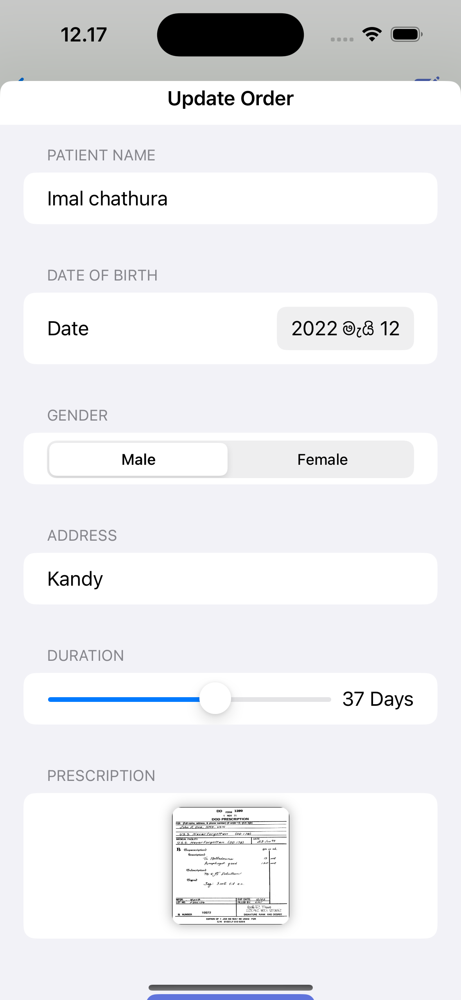
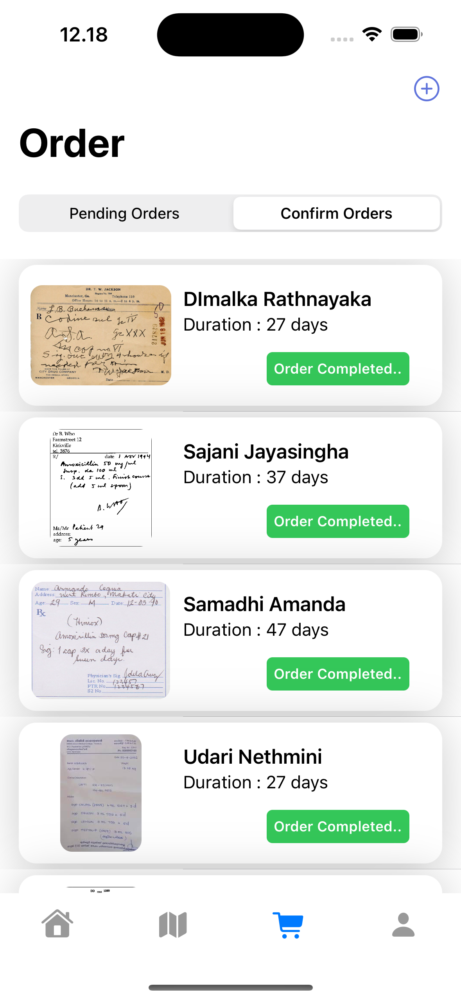
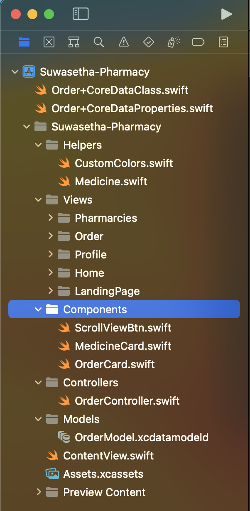
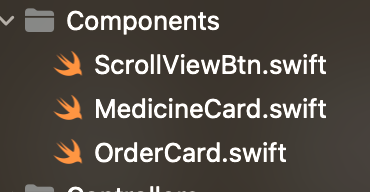

# Project Name - Suwasetha Pharmecy system
# Student Id - IT20167028
# Student Name - Thiranjaya W.A.L.N

#### 01. Brief Description of Project - 

Suwasetha Pharmacy is a mobile application designed to simplify the process of ordering pharmacy items (drugs) for users. The app allows users to order prescription medications and other pharmacy items by providing the prescription details, delivery address, and patient information. This makes the ordering process more accurate and time-saving, as users no longer need to physically visit a pharmacy or make phone calls to place an order.

The application has a user-friendly interface that allows users to easily navigate through the app. Upon opening the app, the user can select the "New Order" option to start the ordering process. The user is then prompted to enter the patient information, prescription details, and delivery address.

Additionally, the application offers a unique feature where users can conveniently check nearby pharmacies on a map. This feature allows users to see locate pharmacies in their vicinity, providing them with a wider range of options for their prescription needs. By utilizing the map feature, users can easily find the nearest pharmacy and place their orders accordingly.

The application also has a feature that allows users to view their pending and closed orders. Pending orders refer to orders that have not yet been received, while closed orders refer to orders that have been received. Users can view the status of their orders and track the delivery progress, ensuring transparency and keeping them informed throughout the process.

Furthermore, users have the flexibility to add, edit, and delete their orders as needed. If a user needs to make changes to an order, they can do so within a day of placing it. This feature enables users to modify their orders if they make a mistake or if their prescription requirements change, providing them with the convenience and control over their pharmacy orders.

#### 02. Users of the System - 
Customer (Patients)

#### 03. What is unique about your solution -

What sets Suwasetha Pharmacy apart is its mobile-based solution that revolutionizes the way users order pharmacy items (drugs). The app simplifies the entire process by eliminating the need for users to physically visit a pharmacy or make phone calls to place an order, thus saving them valuable time and effort.

In addition to these conveniences, the app offers a unique feature that allows users to check nearby pharmacies on a map. By integrating a map function, users can easily locate and explore pharmacies in their vicinity, providing them with a broader range of options for their prescription needs. This feature empowers users to make informed decisions by conveniently assessing the availability and proximity of nearby pharmacies.

Moreover, Suwasetha Pharmacy enables users to input their prescription details, patient information, and delivery address, ensuring accuracy in the ordering process and minimizing the likelihood of errors. The app also includes comprehensive features that allow users to track the status of their orders, view pending and closed orders, and make necessary changes or updates.

#### 04. Differences of Assignment 02 compared to Assignment 01
Assignment 01:
In this assignment, a mobile app is created using SwiftUIKit and Core Data. The app aims to provide a solution for users to search for medicines and place orders. The user interface (UI) design is implemented using storyboard, which allows for a visual and intuitive way of creating UI elements without the need for extensive programmatic coding. However, one limitation of this approach is that users cannot view the nearest pharmacy locations directly on a map.

Assignment 02:
For this assignment, a mobile app is developed using SwiftUI, Core Data, and MapKit. Similar to Assignment 01, the app allows users to search for medicines and place orders. However, all the UI elements are created programmatically using SwiftUI, providing more flexibility and control over the user interface. Additionally, the app leverages MapKit to enable users to view the nearest pharmacy locations on a map. Users can search for any area and the app will display the corresponding pharmacies, empowering users to make informed decisions based on their proximity to different pharmacy options.

Assignment 02 offers several advantages over Assignment 01. Firstly, the use of SwiftUI for UI development provides greater flexibility and control, allowing for a more customized and dynamic user interface. It offers a more modern and streamlined approach to UI design, making it easier to adapt to different device sizes and orientations.

Secondly, the inclusion of MapKit in Assignment 02 enhances the user experience by enabling users to visualize the nearest pharmacy locations on a map. This feature provides valuable information for users, allowing them to easily identify and select the most convenient pharmacy based on their location or a specific area of interest.

Furthermore, Assignment 02 allows users to search for pharmacies in any area, expanding the app's functionality and usability. This empowers users to proactively explore different regions or plan ahead, ensuring they have access to the medications they need, regardless of their current location.

#### 05. Briefly document the functionality of the screens you have (Include screen shots of images)
e.g. The first screen is used to capture a photo and it will be then processed for identifying the landmarks in the photo.

# Landing Screen
 

# Home Screen
 

# Order Screen
 

# Add Order Screen
 

# Delete order Screen
 

# View Specific Order Screen
 

# Order Update Screen
 

# Confirmed Order Screen
 

# Map Screen
 

# Specific pharmacy details Screen
 

#### 06. Give examples of best practices used when writing code

# Clean folder structure


# Add meaningfull comment for future understatnding
```
    func getData(orderStatus: String) -> [Order] {
        //create fetch request
        let fetchRequest: NSFetchRequest<Order> = Order.fetchRequest()
        //add condition to request
        let predicate = NSPredicate(format: "orderStatus == %@", orderStatus)
        let sortDescriptor = NSSortDescriptor(key: "orderStatus", ascending: true)
        
        //save data to array
        fetchRequest.predicate = predicate
        fetchRequest.sortDescriptors = [sortDescriptor]
        
        do {
            // return result
            let fetchedResults = try container.viewContext.fetch(fetchRequest)
            return fetchedResults
        } catch {
            //Error handling
            print("Error fetching data: \(error.localizedDescription)")
            return []
        }
    }
```

# Write reusable functions and components

1. Reusable components <br>
 <br>

```
//Use of above reusable compinents
 ScrollView(.horizontal){
                        HStack(spacing: 15){
                            ScrollViewBtn(icon: "person.fill.badge.plus", text: "Apoinment", function: {})
                            ScrollViewBtn(icon: "stethoscope", text: "Check Ups", function: {})
                            ScrollViewBtn(icon: "cross.case", text: "Medicines", function: {})
                            ScrollViewBtn(icon: "bed.double", text: "Hospitals", function: {})
                            ScrollViewBtn(icon: "dumbbell", text: "Fitness", function: {})
                            ScrollViewBtn(icon: "rectangle.grid.2x2", text: "More", function: {})
                        }
                    }
                    .scrollIndicators(.hidden)
```

2.function helps to filter and get any order status from db (reusable function)
```
    func getData(orderStatus: String) -> [Order] {
        //create fetch request
        let fetchRequest: NSFetchRequest<Order> = Order.fetchRequest()
        //add condition to request
        let predicate = NSPredicate(format: "orderStatus == %@", orderStatus)
        let sortDescriptor = NSSortDescriptor(key: "orderStatus", ascending: true)
        
        //save data to array
        fetchRequest.predicate = predicate
        fetchRequest.sortDescriptors = [sortDescriptor]
        
        do {
            // return result
            let fetchedResults = try container.viewContext.fetch(fetchRequest)
            return fetchedResults
        } catch {
            //Error handling
            print("Error fetching data: \(error.localizedDescription)")
            return []
        }
    }
```

# Error handling
```
    func getData(orderStatus: String) -> [Order] {
        //create fetch request
        let fetchRequest: NSFetchRequest<Order> = Order.fetchRequest()
        //add condition to request
        let predicate = NSPredicate(format: "orderStatus == %@", orderStatus)
        let sortDescriptor = NSSortDescriptor(key: "orderStatus", ascending: true)
        
        //save data to array
        fetchRequest.predicate = predicate
        fetchRequest.sortDescriptors = [sortDescriptor]
        
        do {
            // return result
            let fetchedResults = try container.viewContext.fetch(fetchRequest)
            return fetchedResults
        } catch {
            //Error handling
            print("Error fetching data: \(error.localizedDescription)")
            return []
        }
    }
```

# The code below uses consistant naming conventions for variables, uses structures and constants where ever possible. 

```
struct Medicine {
    var id : String
    var name : String
    var image : String
    var company: String
    var price : Double
}


let medicines : [Medicine] = [
    Medicine(id: "1", name: "Methylenetetrahydrofolate", image: "m1", company: "Test Name", price: 40.00),
    Medicine(id: "2", name: "Tramadol Hydrochloride", image: "m2", company: "Test Name", price: 10.00),
    Medicine(id: "3", name: "Levothyroxine Sodium", image: "m3",company: "Test Name", price: 34.98),
    Medicine(id: "4", name: "Amoxicillin-Clavulanate", image: "m4",company: "Test Name", price: 02.00),
    Medicine(id: "5", name: "Prednisolone Acetate", image: "m5",company: "Test Name", price: 12.80),
    Medicine(id: "6", name: "Ceftriaxone Sodium", image: "m1",company: "Test Name", price: 24.99),
    Medicine(id: "7", name: "Atenolol-Chlorthalidone", image: "m2",company: "Test Name", price: 20.90)
]
```

#### 07. UI Components used
Slider, TextField, picker, datePicker, PhotoPicker, SegmentedControl, Scrollview, List, Form, NavigationStack, VStack, HStack


#### 08. Testing carried out

1. Unit Test
```
  class OrderControllerTests: XCTestCase {
    var orderController: OrderContoller!
    override func setUp() {
        super.setUp()
        orderController = OrderContoller()
    }
    
    override func tearDown() {
        super.tearDown()
        orderController = nil
    }
    
    func testAddOrder() {
        let context = orderController.container.viewContext
        
        let initialCount = orderController.getData(orderStatus: "Pending").count
        
        orderController.addOrder(patientName: "John Doe", patientDob: Date(), gender: "Male", address: "123 Main St", prescription: Data(), duration: 7, context: context)
        
        let finalCount = orderController.getData(orderStatus: "Pending").count
        
        XCTAssertEqual(finalCount, initialCount + 1, "Order count should increase by 1 after adding an order")
    }
    
    func testEditOrder() {
        let context = orderController.container.viewContext
        
        let order = Order(context: context)
        order.patientName = "Jane Smith"
        order.patientDob = Date()
        order.gender = "Female"
        order.address = "456 Elm St"
        order.prescription = Data()
        order.duration = 10
        
        orderController.editOrder(order: order, patientName: "New Name", patientDob: Date(), gender: "Male", address: "New Address", prescription: Data(), duration: 5)
        
        XCTAssertEqual(order.patientName, "New Name", "Order's patient name should be updated")
        XCTAssertEqual(order.duration, 5, "Order's duration should be updated")
    }
    
    func testDeleteOrder() {
        let context = orderController.container.viewContext
        
        let order = Order(context: context)
        
        let initialCount = orderController.getData(orderStatus: "Pending").count
        
        let allpendingOrders = orderController.getData(orderStatus: "Pending")
        
        if let lastElement = allpendingOrders.last {
            orderController.deleteOrder(order: lastElement)
        }
                
        let finalCount = orderController.getData(orderStatus: "Pending").count
        
        XCTAssertEqual(finalCount, initialCount - 1, "Order count should decrease by 1 after deleting an order")
    }
    
    func testMarkOrderAsCompleted() {
        let context = orderController.container.viewContext
        
        let order = Order(context: context)
        
        orderController.markOrderAsCompleted(order: order)
        
        XCTAssertEqual(order.orderStatus, "Completed", "Order's status should be marked as 'Completed'")
    }
    
}

```

2. UI test
```
    func testExample() throws {
        // UI tests must launch the application that they test.
        let app = XCUIApplication()
        app.launch()
        
        app.buttons["Get Start"].tap()
        app.textFields["Search.."].tap()
        app.tabBars["Tab Bar"].buttons["Shopping Cart"].tap()
        
        app.navigationBars["Order"]/*@START_MENU_TOKEN@*/.buttons["Add Food"]/*[[".otherElements[\"Add Food\"].buttons[\"Add Food\"]",".buttons[\"Add Food\"]"],[[[-1,1],[-1,0]]],[0]]@END_MENU_TOKEN@*/.tap()
        
        let collectionViewsQuery = app.collectionViews
        let patientNameTextField = collectionViewsQuery/*@START_MENU_TOKEN@*/.textFields["Patient Name"]/*[[".cells.textFields[\"Patient Name\"]",".textFields[\"Patient Name\"]"],[[[-1,1],[-1,0]]],[0]]@END_MENU_TOKEN@*/
        patientNameTextField.tap()
        patientNameTextField.tap()
        
        let addressTextField = collectionViewsQuery/*@START_MENU_TOKEN@*/.textFields["Address"]/*[[".cells.textFields[\"Address\"]",".textFields[\"Address\"]"],[[[-1,1],[-1,0]]],[0]]@END_MENU_TOKEN@*/
        addressTextField.tap()
        addressTextField.tap()
        collectionViewsQuery/*@START_MENU_TOKEN@*/.staticTexts["PRESCRIPTION"].swipeRight()/*[[".cells.staticTexts[\"PRESCRIPTION\"]",".swipeUp()",".swipeRight()",".staticTexts[\"PRESCRIPTION\"]"],[[[-1,3,1],[-1,0,1]],[[-1,2],[-1,1]]],[0,0]]@END_MENU_TOKEN@*/
        collectionViewsQuery/*@START_MENU_TOKEN@*/.sliders["7"].press(forDuration: 0.7);/*[[".cells.sliders[\"7\"]",".tap()",".press(forDuration: 0.7);",".sliders[\"7\"]"],[[[-1,3,1],[-1,0,1]],[[-1,2],[-1,1]]],[0,0]]@END_MENU_TOKEN@*/
        collectionViewsQuery/*@START_MENU_TOKEN@*/.buttons["Place Order"]/*[[".cells.buttons[\"Place Order\"]",".buttons[\"Place Order\"]"],[[[-1,1],[-1,0]]],[0]]@END_MENU_TOKEN@*/.tap()
        
        // Use XCTAssert and related functions to verify your tests produce the correct results.
    }
```

#### 09. Documentation 

(a) Design Choices
When developing an ISO mobile application for an online pharmacy system, several design choices need to be made to ensure a user-friendly and efficient experience for both customers and administrators. This paragraph discusses the design choices related to SwiftUI, CoreData, and MapKit.

Firstly, SwiftUI is a powerful framework provided by Apple for building user interfaces across all Apple platforms. Choosing SwiftUI for the mobile application's user interface design offers several advantages. SwiftUI utilizes a declarative syntax, allowing developers to describe the desired user interface and its behavior. This approach simplifies the development process, reduces the amount of code needed, and provides real-time previews, enhancing the overall productivity and efficiency of the development workflow. Additionally, SwiftUI is designed to work seamlessly with other Apple frameworks and technologies, such as MapKit, allowing for easier integration and a consistent user experience.

Secondly, CoreData is an essential framework for data management in iOS applications. By utilizing CoreData as the persistence layer for the online pharmacy system, several benefits are achieved. CoreData provides a powerful object graph management system that allows for efficient data manipulation and retrieval. It supports data modeling, versioning, and migration, making it easier to evolve the application over time. CoreData also integrates well with SwiftUI, enabling a smooth and synchronized user interface when interacting with data. With CoreData's ability to handle complex relationships and optimize data fetching, it becomes an ideal choice for managing the inventory, user profiles, and order history in the online pharmacy system.

Lastly, integrating MapKit into the application allows for enhanced functionality and convenience for both customers and administrators. MapKit provides mapping and location services, which can be leveraged to display nearby pharmacies, track delivery routes, or help customers locate the nearest pick-up points. By incorporating MapKit, the application can provide real-time directions, estimated delivery times, and accurate distance calculations, enhancing the overall user experience. Additionally, for administrators, MapKit can assist in optimizing delivery routes, improving efficiency, and reducing costs.

(b) Implementation Decisions

To effectively implement the ISO mobile application for the online pharmacy system, several key decisions need to be made based on the design choices previously discussed. This paragraph outlines the implementing decisions for the application, considering the use of SwiftUI, CoreData, and MapKit.

Regarding the user interface, the application will be designed using SwiftUI's declarative syntax and layout system. This decision allows developers to describe the desired UI components and their behavior in a concise and intuitive manner. By utilizing SwiftUI's built-in components and modifiers, the application will have access to a rich set of interactive and responsive views. Implementing user interactions, such as gestures, animations, and input validation, will be achieved using SwiftUI's event handling mechanisms, ensuring a seamless and engaging user experience.

To manage data in the online pharmacy system, CoreData will be implemented as the persistence layer. The CoreData stack, including the managed object context, persistent store coordinator, and managed object model, will be set up to facilitate data management operations. The CoreData data model will be carefully designed to represent entities like medications, customer profiles, orders, and their relationships. Utilizing CoreData's relationships and fetched properties will optimize data fetching and enable efficient management of complex data structures. CRUD operations (Create, Read, Update, Delete) will be implemented using CoreData, ensuring seamless interaction with the underlying data store.

Integrating the MapKit framework into the application will enable leveraging mapping and location services. The implementation will include displaying maps, annotations, and overlays using MapKit's APIs to visualize pharmacies.

(c) Challenges
Developing a Swift UI mobile application can present a range of challenges that require careful consideration and proactive problem-solving. One of the primary hurdles is the limited availability of resources for Core Data and MapKit. These frameworks may have less extensive documentation and community support compared to more established tools, necessitating a thorough exploration of official documentation and online forums to find relevant solutions.

Another challenge is debugging errors within a Swift UI project. Due to the declarative nature of the framework, pinpointing the root cause of errors or unexpected behavior can be demanding. Familiarizing yourself with error messages, utilizing debugging tools like breakpoints, and following best practices for error handling will be vital for efficient troubleshooting.

Time management is crucial in mobile application development, particularly when working under tight deadlines. As Swift UI may be relatively new to developers, allocating sufficient time for learning, experimentation, and problem-solving while juggling other project requirements is essential for meeting deadlines and delivering a polished application.

Designing a user-friendly interface is critical for app success. Swift UI offers powerful tools for interface design, but it requires a solid understanding of layout, navigation, and user interaction patterns. Adhering to Apple's Human Interface Guidelines, considering accessibility features, and conducting usability testing will ensure a seamless and intuitive user experience.

Limited knowledge of development tools, including Swift UI, Core Data, and MapKit, can pose a significant challenge. To overcome this, investing time in learning and practicing the fundamentals of each tool, leveraging online resources and tutorials, and seeking guidance from experienced developers or joining developer communities can help bridge the knowledge gap.

#### 10. Additional iOS Library used
PhotoUI and MapKit

My mobile application utilizes PhotoUI and MapKit frameworks to enhance user experience. With PhotoUI, users can effortlessly upload images, while MapKit enables the integration of maps into the application, allowing users to locate nearby pharmacies.

The PhotoUI framework empowers users to seamlessly upload images from their device's gallery or capture new ones using the app's camera functionality. This feature facilitates the inclusion of visuals in various scenarios, such as sharing experiences, identifying issues, or documenting relevant information. By leveraging PhotoUI, the application simplifies the process of image selection and manipulation, providing a user-friendly interface for managing and uploading photos.

Additionally, the integration of MapKit into the application enables users to access and utilize interactive maps. This integration offers a range of functionalities, including displaying the user's current location, finding nearby pharmacies, and providing directions to those locations. With MapKit, users can conveniently explore their surroundings, identify the nearest pharmacies, and access relevant information such as addresses, contact details, and operating hours.

A brief description on how you addressed the last part of the marking rubric.

#### 11. Reflection of using SwiftUI compared to UIKit

SwiftUI is a modern and intuitive framework for building user interfaces in iOS, macOS, watchOS, and tvOS applications. It provides a more declarative and concise approach to UI development compared to the traditional UIKit framework.

With SwiftUI, developers can create user interfaces using a simple and readable syntax, making it easier to understand and maintain code. The framework embraces a reactive programming model, where UI elements automatically update based on changes to underlying data, eliminating the need for manual updates and reducing boilerplate code.

One significant advantage of SwiftUI is its ability to provide real-time previews of the UI during the development process. Developers can see the changes they make in code reflected instantly in the preview canvas, allowing for rapid iteration and a more efficient development workflow.

SwiftUI also offers a wide range of built-in components and controls that can be easily customized and combined to create complex UI layouts. It simplifies the process of handling user input, animations, and navigation, providing a more streamlined development experience.

#### 12. Reflection General

Suwasetha Pharmacy Application is a SwiftUI-based iOS application that facilitates the management of pharmacy orders and prescriptions. It utilizes CoreData for efficient data storage and retrieval, while also incorporating the MapKit package for location-based functionalities. The application provides a user-friendly interface for adding and managing pharmacy orders, with seamless integration of map features to display the pharmacy's location. Although the development process presented challenges due to limited resources and the complexities of debugging SwiftUI and CoreData, the application overcame these obstacles and offers a convenient solution for users to manage their pharmacy-related tasks.

  
